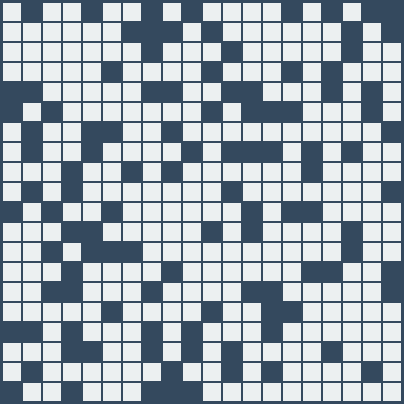
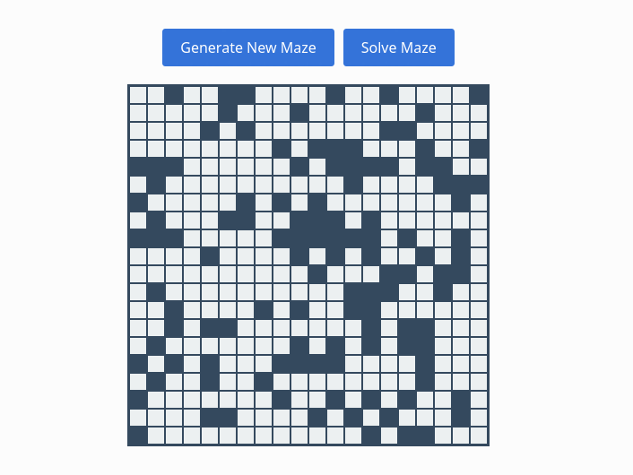
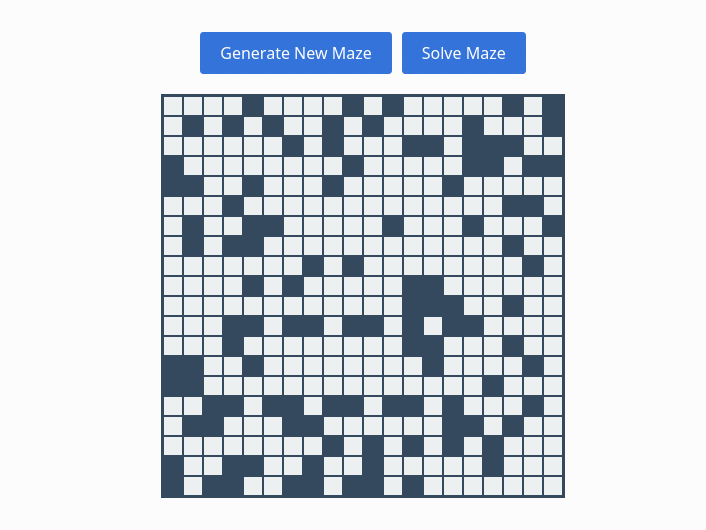

# Wave Function Collapse Maze Generator and Solver

<p align="center">
  
</p>

This project creates unique labirynths by utilising the Wave Function Collapse algorithm. 
Thanks to WFC algorithm, the generated mazes are **always solveable** and, by implementing 
the Dijkstra's algorithm, the project is able to find the quickest, continuous path from 
the maze's start to its end. 

You can benefit from this project if you'd like to develop a maze-based game and are 
looking for a program to generate these mazes for you. Alternatively, you can 
use this project to learn how to write similar generators and/or solvers.

## Table of Contents

<!-- no toc -->
- [How to Run It](#how-to-run-it)
- [What It Does](#what-it-does)
- [How It Works](#how-it-works)
- [Contributing](#contributing)
- [License](#license)

## How to Run It

You can follow these steps to install and run the project on your computer:

1. Clone the repository and enter the directory:
   ```bash
   git clone https://github.com/amazebasics/WFCMazeWebApp.git
   cd WFCMazeWebApp
   ```

2. Use the browser of your choice (e.g. Firefox) to open `index.html`:
   ```bash
   firefox index.html
   ```

3. Use blue buttons to generate and/or solve mazes.


## What It Does

**By clicking "Generate New Maze", you can generate original, solveable mazes**:
  
<p align="center">
  
</p>

**By clicking "Solve Maze" button, you can view the maze's solution**:

<p align="center">
  
</p>

## How It Works

This project utilises two algorithms: one to create mazes and one to solve them:

- Wave Function Collapse algorithm is responsible for creating the mazes. Robert Heaton explained it very well [on his blog](https://robertheaton.com/2018/12/17/wavefunction-collapse-algorithm/).
- Dijkstra's algorithm is used to solve the generated mazes. You can read all about it on [Wikipedia](https://en.wikipedia.org/wiki/Dijkstra%27s_algorithm).

## Contributing

All contributions to this project are welcome! Just follow these steps:

1. Fork the repository.
2. Create a feature branch (`git checkout -b feature/your-feature-name`).
3. Commit your changes (`git commit -am 'Add some feature'`).
4. Push to the branch (`git push origin feature/your-feature-name`).
5. Create a new Pull Request.

## License

This project is licensed under the MIT License - see the [LICENSE](LICENSE) file for details.
